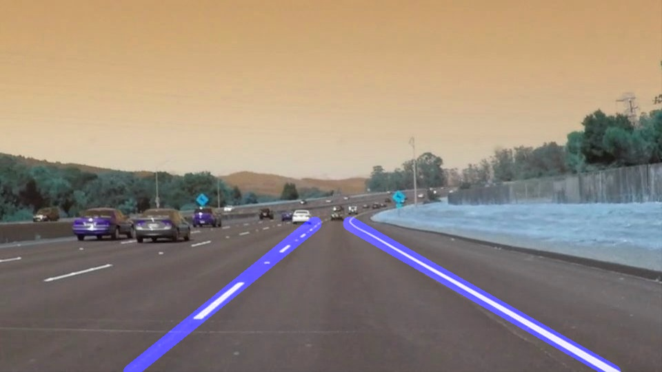
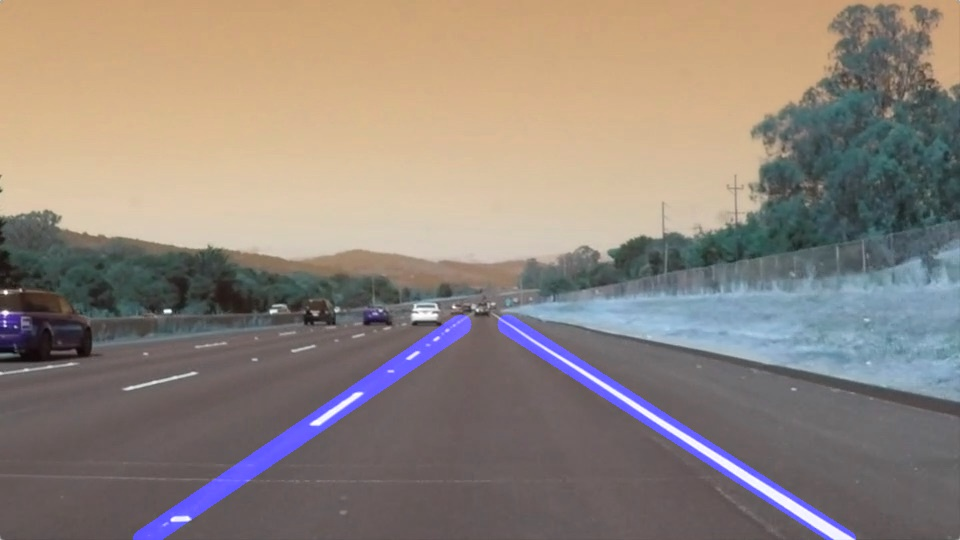
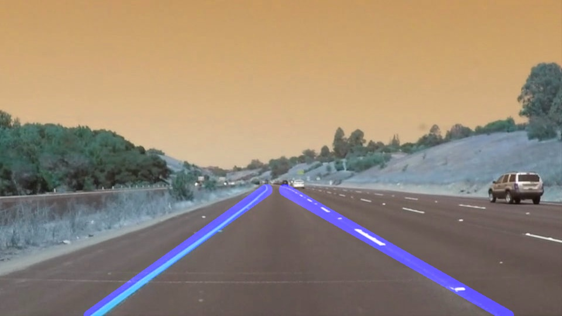
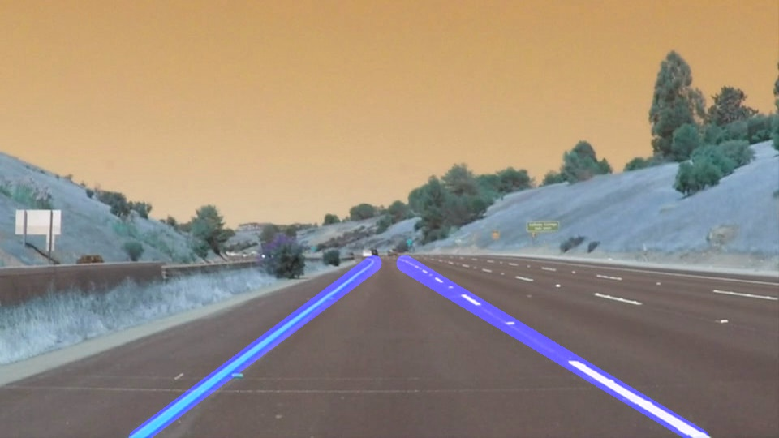
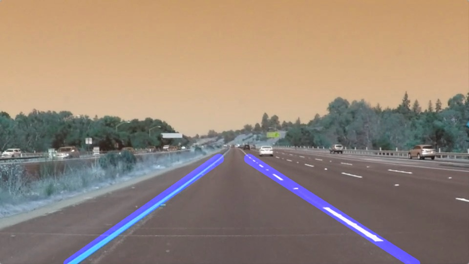
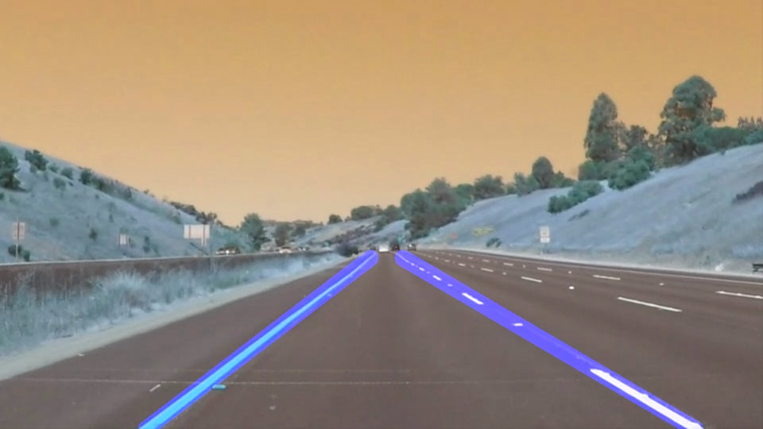

# **Finding Lane Lines on the Road**

---
The goals / steps of this project are the following:
* Make a pipeline that finds lane lines on the road
* Reflect on your work in a written

[//]: # (Image References)

[image1]: ./solidWhiteCurve_output.jpg "solidWhiteCurve_output"
[image2]: ./solidWhiteRight_output.jpg "solidWhiteRight_output"
[image3]: ./solidYellowCurve_output.jpg "solidYellowCurve_output"
[image4]: ./solidYellowCurve2_output.jpg "solidYellowCurve2_output"
[image5]: ./solidYellowLeft_output.jpg "solidYellowLeft_output"
[image6]: ./whiteCarLaneSwitch_output.jpg "whiteCarLaneSwitch_output"
[image7]: ./solidWhiteRight.gif "solidWhiteRight"
[image8]: ./solidYellowLeft.gif "solidYellowLeft"

---

### Reflections

### 1. Finding the lane lines in the image
**Step 1:**
This step involved applying the concepts taught before starting this project. First, I converted the images to grayscale, then I applied gaussian smoothing to suppress noise and avoid spurious gradients by averaging. Also, I used openCV 'canny' function to find the gradient of the blurred grey scale image. Second, I defined a four sided polygon region by manually specifying the vertices in such a way that the polygon encloses only those pixels where we expect to find lane lines and masks everything else. Then I applied hough transform to the masked image(output of canny) to find the lane lines. Each function is performed by calling corresponding helper functions from the main function 'pipeline(image)'.

**Step 2:** In order to draw a single line on the left and right lanes, I created two new functions 'detect_left_right(lines)' and 'avg_lanes(y1, y2, line)'. The function 'detect_left_right()' takes the output data from hough transform and separates it into the data corresponding to left lane and right lane. This is done by identifying the slope of line connecting points from hough transform. Once I had two sets of points(left and right), I utilized 'cv2.fitline()' function to fit a line through points in each data set. The output of this function gives the slope and intercept of each fitted line. In the function 'avg_lanes()', the y-coordinates of the start and end points of each line are approximated to find corresponding x-coordinates using the slope and intercept data from 'detect_left_right()' fucntion.
Both these functions are called from the main function 'pipeline(image)'. Finally, the extrapolated lines on the left and right lane are drawn through 'draw_lines()' function, which takes the start and end co-ordinates of the lines from 'avg_lanes()' function as input.

**Step 3:** In the final stage, the parameters of canny edge detection and hough transform are tuned to obtain better results when the algorithm developed in step 1 and step 2 is applied on video.

The images below are the output of the pipeline when tested on images in folder-'test_images'.

 

 

 

Below are the results of the pipeline when tested on videos in folder- 'test_videos'.

### 2. Potential shortcomings with current pipeline

Although the proposed algorithm worked well on videos with solid white lanes and solid yellow lanes after parameter tuning, similar performance has not been observed on the optional challenge video. This implies that this pipeline is not robust enough to work on the regions of lanes covered with shadows.

Another shortcoming of this code is that it fails to work on those videos where the road has ups and downs.

Also, this code requires manually specifying the vertices of the polygon that encloses lane lines. Such code fails in the cases when car changes the lane.

### 3. Possible improvements to the pipeline

One possible improvement would be to further tune parameters to get the code work on the challenge video with shadows. However, this is not the ultimate solution as tuned parameters might not yield required result on different frames. Instead, we could use existing algorithms like PROSAC, RANSAC or KALMANSAC, which could iteratively estimate the model parameters and eliminate outliers.
